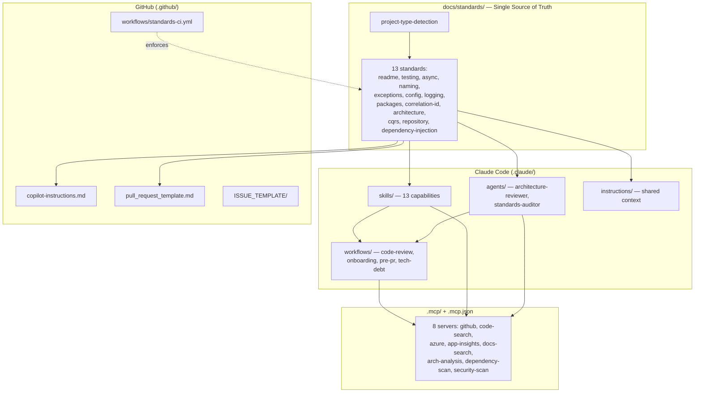

# Framework Overview

This repository hosts a **reusable, repository-agnostic agentic engineering framework**
for .NET solutions, driven by Claude Code and GitHub Copilot. It adds repository-level
automation only — **no business code, no new projects**.

## How the pieces fit together

## Design principles

1. **Single source of truth.** Every rule is defined once in `docs/standards/`. Skills,
   subagents, and `copilot-instructions.md` *reference* those docs — never restate them.
   One edit updates both toolchains.
2. **Detect, don't assume.** Every skill/agent/workflow runs project-type detection
   first and adapts to the detected type(s).
3. **Repository-agnostic.** Nothing hardcodes a project's layout. Drop the framework into
   any .NET repo (Web API, Functions, Durable, MVC, Blazor, Worker, Console).
4. **Drop-in safe.** CI is opt-in and non-blocking until a repo is compliant; MCP secrets
   are env-var placeholders only. The framework never breaks a host repo on arrival.
5. **Review by default, change on request.** Enforcers report `file:line` evidence and
   apply only mechanical, behavior-preserving fixes automatically; breaking changes are
   flagged for approval. No business code is generated unless explicitly requested.

## Two toolchains, one standard

| | Claude Code | GitHub Copilot |
|---|---|---|
| Entry point | Skills auto-invoked by description; subagents for deep passes; workflows to orchestrate | `copilot-instructions.md` read automatically in-editor |
| Source of rules | `docs/standards/*.md` | `docs/standards/*.md` (same files) |
| Enforcement in CI | (optional) via workflows | `.github/workflows/standards-ci.yml` |

## Capability map

| Capability | Skill | Standard |
|---|---|---|
| README generation | `readme-generator` | readme-standard |
| Unit tests | `unit-test-generator` | testing-standard |
| Async correctness | `async-await-enforcer` | async-standard |
| Naming | `naming-convention-enforcer` | naming-standard |
| Exceptions | `exception-handling-enforcer` | exception-handling-standard |
| Configuration | `configuration-pattern-enforcer` | configuration-standard |
| Logging | `logging-enforcer` | logging-standard |
| Packages | `package-governance` | package-governance-standard |
| Correlation IDs | `correlation-id-enforcer` | correlation-id-standard |
| CQRS / Mediator | `cqrs-pattern-enforcer` | cqrs-standard |
| Repository & Unit of Work | `repository-pattern-enforcer` | repository-pattern-standard |
| Dependency injection | `dependency-injection-enforcer` | dependency-injection-standard |
| Architecture | `architecture-reviewer` (+ subagent) | architecture-standard |

See [extending-the-framework](./extending-the-framework.md) to add a new capability.
