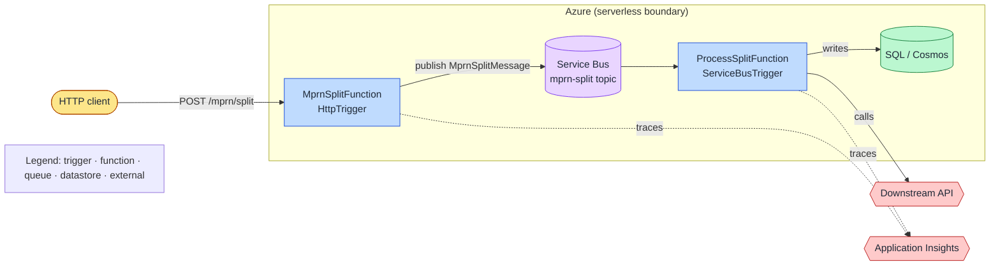

# Standard: README

> Canonical definition of a "comprehensive README" for any supported .NET solution.
> Consumed by the `readme-generator` skill and the `repo-onboarding` workflow.

## Principles

- The README is generated **from the actual solution**, never from assumptions.
  Run [project-type-detection](./project-type-detection.md) first and tailor each
  section to the detected types.
- Describe what exists; do not invent endpoints, services, or infrastructure.
- Prefer accurate, scannable content over marketing prose.

## Required sections (in order)

1. **Overview** — what the solution does, business purpose, primary consumers.
2. **Architecture & Flow** — the centerpiece. A reader must understand **what kind of
   architecture this is** from the diagram alone. This section MUST contain, in order:
   - **Architecture classification** — a one-line label + short rationale, e.g.
     *"Event-driven serverless (Azure Functions) with Service Bus messaging"*,
     *"Layered Clean Architecture Web API with CQRS/MediatR"*,
     *"Durable Functions fan-out/fan-in orchestration"*, *"Background worker pipeline"*.
   - **System architecture diagram** — a styled Mermaid diagram (see
     [Diagram guidelines](#architecture-diagram-guidelines)) showing components,
     boundaries, triggers, data stores, messaging, and external integrations, with
     visual encoding so the architecture *type* is obvious at a glance.
   - **Flow / data-movement diagram** — a Mermaid `sequenceDiagram` (or flowchart)
     tracing a representative request/message end-to-end through the system.
   - **Trigger/endpoint table** — for Functions: every function with **Trigger type**
     (Http/Timer/ServiceBus/Blob/Queue/Event Grid/Orchestration/Activity), **inputs**
     (body/headers/params/bindings), and **outputs** (status codes/body/output
     bindings). For Web API/MVC: controllers/routes with verbs and responses.
   Render and validate every diagram through a diagram connector when available — see
   the guidelines below — and embed the validated Mermaid source in fenced blocks so it
   also renders natively on GitHub.
3. **Solution Structure** — table of projects: name, detected type, responsibility,
   key folders.
4. **Project Dependencies** — internal project references (graph) and notable external
   packages grouped by concern (data, messaging, observability, Azure SDKs).
5. **Design Patterns** — patterns actually found (CQRS, MediatR, Repository, Options,
   Factory, Decorator, etc.) with the file/namespace where each appears.
6. **Configuration Requirements** — every required setting, its source
   (`appsettings.json` / `local.settings.json` / env var / Azure App Configuration /
   Key Vault), and whether it is validated at startup. Cross-reference
   [configuration-standard](./configuration-standard.md).
7. **Deployment Process** — how each project deploys (App Service, Function App,
   container, etc.), referencing detected types; CI/CD entry points if present.
8. **Logging Strategy** — per [logging-standard](./logging-standard.md): structured
   logging, `ILogger<T>`, Application Insights, correlation IDs.
9. **Monitoring Strategy** — health checks, App Insights dashboards/alerts, key
   metrics, distributed tracing via correlation IDs.
10. **Security Considerations** — auth scheme, secret management, transport security,
    input validation, known sensitive surfaces.
11. **Local Development Instructions** — prerequisites (SDK version from TFM), restore/
    build/run commands per project type, required local config, emulators
    (Azurite/Cosmos emulator) when Functions/storage are detected.
12. **Troubleshooting Guide** — common failures and resolutions inferred from the
    stack (missing config, auth, connection strings, port conflicts, cold start).

## Output rules

- Write to `README.md` at the repo root. If one already exists, do **not** silently
  overwrite — produce the proposed content and diff/summary of changes for review.
- Use relative links to source files where helpful (clickable in editors).
- Keep diagrams in fenced ```mermaid blocks so they render on GitHub.
- Never include secrets, real connection strings, or credentials — use placeholders.

## Architecture diagram guidelines

The goal: **a reader identifies the architecture style from the picture alone.** Make
diagrams accurate (built from detected code, not assumptions), readable, and styled.

### Pick the diagram type for the architecture

| Detected architecture | Recommended Mermaid type |
|---|---|
| Cloud/serverless topology (Functions + queues + stores + external services) | `architecture-beta` (groups + service icons) or styled `flowchart LR` |
| System context / containers / components (Web API, MVC, Blazor solutions) | `C4Context` / `C4Container` / `C4Component` |
| Layered / Clean Architecture (Domain→App→Infra→Host) | `flowchart TD` with one **subgraph per layer** |
| Durable Functions orchestration (fan-out/fan-in) | `flowchart LR` (orchestrator→activities) + a `sequenceDiagram` for the timeline |
| Request / message flow & data movement | `sequenceDiagram` |
| State-machine style processing | `stateDiagram-v2` |

### Visual encoding (so the type is obvious)

- **Group with `subgraph`s** to show boundaries: layers, the cloud boundary, the
  message bus, external systems. Set an explicit `direction` (`TD` for layered,
  `LR` for pipelines/event flow).
- **Differentiate node roles with `classDef` styling** (color/shape) and a small
  **legend** node. Suggested classes: `trigger`, `function`, `service`, `queue`,
  `datastore`, `external`, `observability`.
- **Shape conventions:** triggers/entry points as stadium `([ ])`, queues/topics as
  `[( )]`-style or labeled cylinders, databases as cylinders `[( )]`, external systems
  as hexagons `{{ }}`, processes/services as rectangles.
- **Label every edge** with what flows (`HTTP POST /split`, `MprnSplitMessage`,
  `writes`, `publishes`) so data movement is explicit.
- For **Azure Functions**, draw each trigger explicitly (HTTP/Timer/ServiceBus/Blob),
  the bindings in/out, the queues/topics, and downstream stores/services — this is what
  makes it read as *event-driven serverless* at a glance.

### Render & validate via a connector (preferred)

When a diagram connector is available, **validate and render** the diagram before
embedding it, so you never ship broken syntax:

- **Mermaid Chart connector** — `validate_and_render_mermaid_diagram`: validates syntax
  and renders a preview; use it for every diagram.
- **draw.io connector** — `create_diagram` (accepts Mermaid **or** draw.io XML):
  produces an interactive/editable diagram; good when the user wants an editable visual
  or a richer cloud-architecture stencil view. For complex flowcharts pass
  `postLayout: verticalFlow|horizontalFlow` with `startNodeIds`/`endNodeIds` for clean
  auto-layout.

Always embed the **validated** Mermaid source in a fenced ```mermaid block in the README
(GitHub renders it natively). If a connector isn't available, still produce
syntactically valid Mermaid and self-check it.

### Example skeleton (cloud/serverless, illustrative)



Replace every node/edge with the **actual** functions, triggers, queues, stores, and
integrations discovered in the solution. Do not ship the placeholder names.
